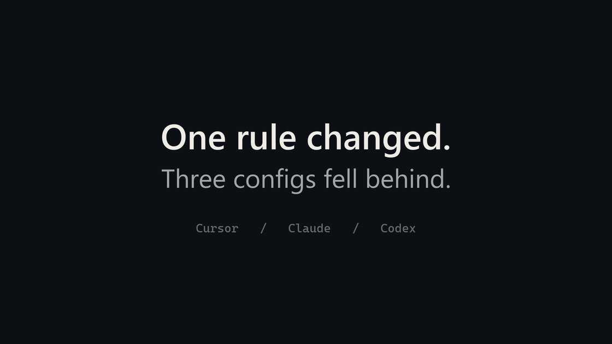

<p align="center">
  <a href="https://github.com/kok-o/contextos-agents">
    
  </a>
</p>

<h1 align="center">contextos-agents</h1>

<p align="center">
  <strong>Maintain your coding-agent rules in one place.</strong><br />
  Export them to supported tools and catch outdated configs in CI.
</p>

<p align="center">
  <a href="https://www.npmjs.com/package/contextos-agents"></a>
  <a href="https://www.npmjs.com/package/contextos-agents"></a>
  <a href="https://nodejs.org/"></a>
  <a href="./LICENSE"></a>
  <a href="https://github.com/kok-o/contextos-agents/actions/workflows/validate-skills.yml"></a>
</p>

<p align="center">
  <a href="#quickstart">Quickstart</a> ·
  <a href="#supported-agents">Supported agents</a> ·
  <a href="./GUIDE.md">Guide</a> ·
  <a href="./CONTRIBUTING.md">Contributing</a>
</p>

---

Using several coding agents in the same project? A rule updated for one tool can
leave another tool's configuration behind. ContextOS keeps your rules in
version-controlled Markdown, exports them to supported agent formats, and checks
whether those exports still match their sources.

It is useful when you or your team maintain instructions across multiple tools
or need a configuration check before merging changes. If a small, stable
instruction file already covers your workflow, you may not need an extra tool.

<p align="center">
  
</p>

<p align="center"><sub>Change a rule. Catch stale exports. Bring them back in sync.</sub></p>

<a id="installation"></a>

## Quickstart

Requires **Node.js 22+** and npm. Run these commands in your project's root.
This workflow does not call a model API.

**1. Initialize the rule sources.**

```sh
npx contextos-agents init --skip-compile
```

This installs the seven core skills. We generate the agent files after adding
your own rule below. See the [guide](GUIDE.md#initialization-options) for presets,
installation previews, and using a pinned project dependency.

**2. Add a rule your team wants to maintain.**

Create the folders and save this as
`.agents/project/skills/team-auth/SKILL.md`:

```markdown
---
name: team-auth
description: Team rules for authentication code.
---
# Team security

- Never log authorization headers.
```

**3. Compile, export, and check.**

```sh
npx contextos-agents compile
npx contextos-agents export all
npx contextos-agents export all --check --json
```

The check should report `"status": "pass"`, `"hasDrift": false`, and exit code
`0`. The rule is now present in generated files such as
`.cursor/rules/team-auth.mdc` and `.agents/skills/team-auth/SKILL.md`.

**See drift detection:** add `- Never log session tokens.` to the same source
file, then run:

```sh
npx contextos-agents compile
npx contextos-agents export all --check --json
```

The check now reports `"status": "drift"` and exits with code `1`: the exports
are out of date. Run `npx contextos-agents export all` and check again to return
to `pass`. Commit the source rules, generated files, and lockfile together.

Edit your rules under `.agents/project/skills/`; generated files are managed
outputs. To use a single adapter, replace `all` with its name, for example
`cursor`. See the [step-by-step onboarding guide](docs/product/onboarding.md)
for task selection, client activation, updates, and removal.

## Check rule changes in CI

After committing a fresh export, run the same consistency check on pull requests.
It checks agent configuration; your application's tests and security checks
remain separate.

<details>
<summary>GitHub Actions example</summary>

Save as `.github/workflows/contextos.yml`:

```yaml
name: Agent rule consistency
on: [pull_request, push]
jobs:
  check:
    runs-on: ubuntu-latest
    steps:
      - uses: actions/checkout@v4
      - uses: kok-o/contextos-agents/.github/actions/contextos-gate@v2.3.1
        with:
          version: '2.3.1'
          adapters: 'all'
          working-directory: '.'
```

Set `adapters` to the adapter or adapters you actually exported.
See [CI configuration](GUIDE.md#ci-configuration-check) for version pinning.

</details>

<a id="supported-agents--compilation"></a>

## Supported agents

| Agent | How ContextOS provides the rules |
| --- | --- |
| Codex | Shared native skills in `.agents/skills/*/SKILL.md`. |
| Gemini CLI | Shared workspace skills plus Gemini exports. |
| Claude Code | `CLAUDE.md` index linking to generated instructions. |
| Cursor | Modular `.cursor/rules/*.mdc` files. |
| GitHub Copilot | Repository instructions and a skill source index. |
| Aider | `CONVENTIONS.md` referenced by `.aider.conf.yml`. |
| Zed | Templates for manual import. |

Export tests and live client loading are separate checks. See the
[compatibility matrix](docs/ADAPTER_COMPATIBILITY.md) for exact paths, tested
client versions, and limitations, including unverified Antigravity loading.

## Beyond the first rule

- **Reuse skills:** install catalog skills and stack presets, or keep team
  overrides. See [skill management](GUIDE.md#skill--catalog-management-skill).
- **Inspect task relevance:** `resolve` recommends skills for a task and explains
  the selection. It does not install or activate them. Ordinary exports use the
  installed skills allowed by the profile, independently of a task's selection.
  See [resolution](GUIDE.md#dynamic-skill-resolution-resolve).
- **Inspect staged changes:** the separate `scan` command and optional hooks
  check supported secret, placeholder, and write-scope patterns. See
  [scanning and hooks](GUIDE.md#security-scanning--governance-hooks).

## Scope and evidence

The core CLI manages rule sources, selection, exports, and configuration checks.
The optional [MCP package](contextos-mcp/README.md) is separate and in beta
(`npm install --save-dev contextos-mcp`); agent execution and runtime orchestration
remain experimental.

Consistent configuration does not guarantee that a model follows every rule.
The [recorded calibration](docs/BENCHMARK_RESULTS.md) found no quality advantage
over vanilla on its test corpus. Install third-party skills only from sources
you trust: their instructions are not sandboxed.

## Documentation

| I want to… | Read |
| --- | --- |
| Look up commands, presets, profiles, and diagnostics | [Guide and cheat sheet](GUIDE.md) |
| Try a task with a custom team rule | [Onboarding](docs/product/onboarding.md) |
| Check agent-specific behavior | [Compatibility matrix](docs/ADAPTER_COMPATIBILITY.md) |
| Understand the compiler and support boundaries | [Architecture](docs/ARCHITECTURE.md) · [Product boundaries](docs/PRODUCT_BOUNDARIES.md) |
| Upgrade or recover a previous configuration | [Migration and rollback](docs/COMPACT_CONTEXT_MIGRATION.md) |
| Review release evidence | [2.3.1 maintenance release](docs/PATCH_RELEASE_2.3.1.md) · [Changelog](CHANGELOG.md) |
| Reproduce the animated example | [Demo commands and renderer](scripts/readme-gif/STORY.md) |

## Contributing

Bug reports, documentation fixes, and examples from real projects are welcome.
See [CONTRIBUTING.md](CONTRIBUTING.md) or
[open an issue](https://github.com/kok-o/contextos-agents/issues).

## License

[Apache-2.0](LICENSE). See [NOTICE](NOTICE) for attribution.
