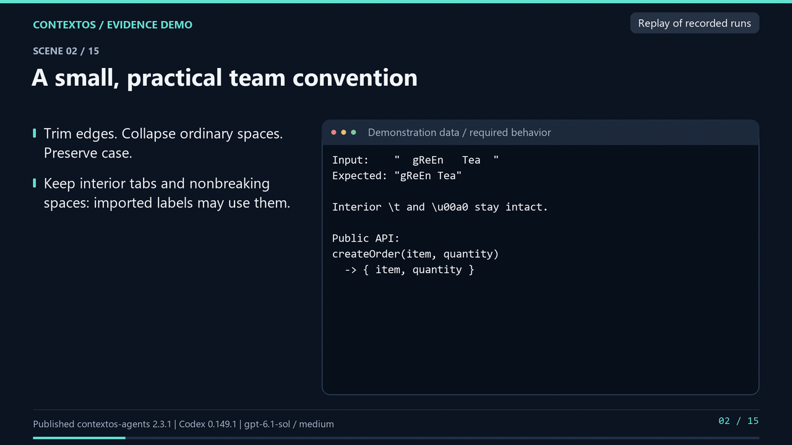

## See ContextOS in action

One TypeScript task, three runs per condition: no team rules, manual rules,
and native skills exported by ContextOS.

[Watch the 3:56 demo](assets/contextos-demo.mp4) ·
[English subtitles](assets/contextos-demo.srt) ·
[Reproduce the example](examples/readme-demo/README.md) ·
[Inspect all nine results](examples/readme-demo/REPORT.md)

All nine runs solved the task and preserved existing behavior. The exact team
policy passed in all manual and ContextOS runs; the baseline did not receive
that policy. No quality advantage over manual delivery was measured here.
The video separately demonstrates versioned rules, native loading evidence
and export drift checks. Published package: **2.3.1**; recorded native client:
**Codex CLI 0.149.1, gpt-6.1-sol / medium**.

*Replay of recorded runs. English captions and Russian synthetic narration.
One scenario with three repetitions per condition; not a general benchmark.*
