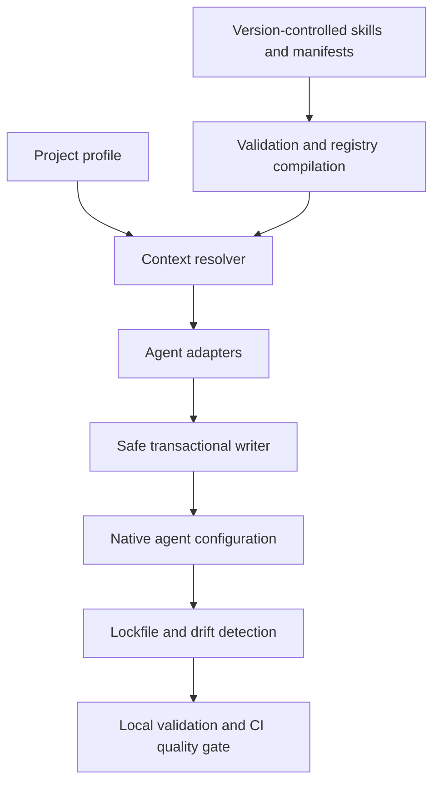

# ContextOS Core Architecture

## Product boundary

The stable `contextos-agents` package manages version-controlled engineering context for supported AI coding agents. It validates source skills and manifests, resolves relevant rules, compiles agent-native files, and detects configuration drift.

The MCP server is a separate beta package. Agent orchestration and code-execution runtime features are experimental and are not part of the stable core contract.

## Core data flow

## Components

### Canonical sources and validation

Engineering skills, rules, and profiles live in the project and are validated before they become generated agent configuration. Registry compilation provides a normalized index for resolution and validation.

### Resolver and adapters

The resolver selects the rules and skills relevant to a task or profile. Adapters compile those sources into supported formats for Gemini, Claude Code, Cursor, GitHub Copilot, Aider, and Zed.

### Safe updates and generated files

Filesystem writes use project-relative paths, mutation locks, and journaled transactions. The lockfile records managed outputs so validation can detect drift and updates can preserve user changes.

### CI quality gate

The quality gate runs validation and checks generated configuration and repository policies. It reports drift so teams can correct generated files before merging.

## Separate packages and experimental features

The read-only MCP server is maintained in `contextos-mcp` and remains beta. Task routing, subagent orchestration, and execution sandboxes are experimental; they carry separate requirements and guarantees from the stable context compiler.
