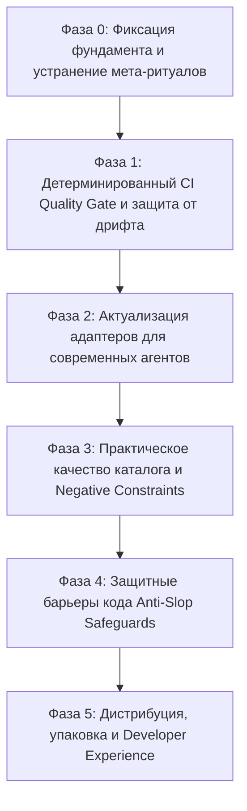

# Дорожная карта развития ContextOS (Roadmap 2026)

## 1. Стратегический контекст и видение продукта

На основе архитектурного решения [ADR-011](./decisions/0011-pivot-to-agent-governance-and-ci-gates.md) ContextOS официально переориентирован с гипотезы сжатия токенов на детерминированное управление правилами для команд с разнородным набором AI-ассистентов:

> **ContextOS - это единый версионируемый источник инженерных стандартов и CI Quality Gate для AI-агентов (Babel / Terraform для правил разработки).**

### Ключевые проблемы, которые решает продукт:
1. **Фрагментация правил**: разработчики в одной команде используют разные инструменты (Cursor, Claude Code, GitHub Copilot, Gemini/Antigravity, Zed, Aider). Правила рассинхронизируются, дублируются и противоречат друг другу.
2. **Дрифт конфигураций в CI**: изменения в правилах делаются локально в сгенерированных файлах (`.cursorrules`, `CLAUDE.md`), минуя общий контроль версий.
3. **Генерация некачественного кода (AI Slop)**: модели генерируют заглушки (`// TODO`), нетипизированный код, допускают утечки секретов и выходят за границы задачи (blast radius).

---

## 2. Фазы реализации дорожной карты

---

## Фаза 0: Фиксация фундамента и устранение мета-ритуалов (Текущий спринт)

**Цель**: зафиксировать рабочее состояние ядра, исключить устаревшие количественные обещания и снять искусственные барьеры.

### Задачи:
1. **Фиксация базового состояния в git**:
   - Зафиксировать в коммите принятый [ADR-011](./decisions/0011-pivot-to-agent-governance-and-ci-gates.md).
   - Зафиксировать расширение лимитов бюджетов в [.agents/resolver/canonical-resolver.js](../.agents/resolver/canonical-resolver.js) (32k / 64k токенов) и адаптацию тестов.
   - Зафиксировать хирургические исправления безопасности и валидации (SSRF в `security`, фокус в `web-accessibility`, CLI-команды в `adapters`, типы в `fastapi`, пути в `context-os`).
   - Зафиксировать расширение [.agents/validate.js](../.agents/validate.js) на проверку всех 32 навыков каталога.
2. **Устранение шума и чрезмерных ритуалов**:
   - В [.agents/core/skills/gstack-roles/SKILL.md](../.agents/core/skills/gstack-roles/SKILL.md): убрать нереалистичные маркетинговые заявления ("810x") и выделить компактное ядро практических ролей (Product Manager, Architect, Senior Developer, QA Lead, Security Officer, Release Engineer).
   - В [.agents/core/skills/engineering-workflow/SKILL.md](../.agents/core/skills/engineering-workflow/SKILL.md): убрать безусловное требование Vercel Preview для проектов, не использующих Vercel; формализовать Fast-Track для небольших задач и фиксов.
   - Обеспечить строгое соблюдение типографики (ASCII дефис вместо длинных тире).

**Критерий приемки Фазы 0**:
- Все 381 тест успешно проходят (`npm test`).
- Валидатор `node .agents/ctx.js validate` проверяет 7 навыков ядра и 32 навыка каталога без ошибок.
- Рабочее дерево зафиксировано в чистом коммите.

---

## Фаза 1: Детерминированный CI Quality Gate и защита от дрифта (1 - 2 недели)

**Цель**: сделать проверку правил полностью автономной и встраиваемой в любой GitHub-репозиторий одной строкой.

### Задачи:
1. **Встроенная проверка дрифта в CLI (`contextos validate --drift` / `contextos export --check`)**:
   - Добавить в [.agents/ctx.js](../.agents/ctx.js) флаг `--drift` для подкоманды `validate` (или `--check` для `export`).
   - Реализовать сравнение in-memory скомпилированных адаптеров с файлами на диске без вызова внешнего `git diff`.
   - Выводить четкий структурированный diff с указанием файла и команды для исправления (`npx contextos export all`).
2. **Публикация GitHub Action (`kok-o/contextos-gate@v2`)**:
   - Доработать [.github/actions/contextos-gate/action.yml](../.github/actions/contextos-gate/action.yml).
   - Поддержка GitHub Workflow Commands (`::error file=...::`) для аннотаций прямо в интерфейсе Pull Request.
   - Формирование краткого Markdown-отчета для PR Summary: статус навыков, статус секретов, статус соответствия конфигов.
3. **Установка git-хуков (`contextos hook install`)**:
   - Превратить скрипт `scripts/install-hooks.js` в штатную CLI-команду.
   - Поддержка pre-commit проверки: мгновенная блокировка коммита при рассинхронизации исходных навыков и файлов в `.cursor/rules/`, `.github/`, `CLAUDE.md`, `.zed/`.

**Критерий приемки Фазы 1**:
- При ручном изменении любого сгенерированного файла (например, `.cursor/rules/00-project-rules.mdc`) команда `node .agents/ctx.js validate --drift` завершается с кодом 1 и указывает точную причину.
- GitHub Action успешно отрабатывает в матрице Node 20, 22 на Ubuntu, Windows, macOS.

---

## Фаза 2: Актуализация адаптеров для современных агентов (1 - 2 недели)

**Цель**: гарантировать безупречную совместимость со спецификациями Cursor, Claude Code, GitHub Copilot, Gemini и Zed актуальных версий 2025 - 2026 годов.

### Задачи:
1. **Cursor MDC v2 Адаптер**:
   - Проверить структуру генерируемых файлов в [.cursor/rules/](../.cursor/rules/).
   - Поддержка frontmatter полей Cursor: `description`, `globs`, `alwaysApply`.
   - Разделение на правила общего действия (`alwaysApply: true`) и контекстные правила по маске (`globs: "**/*.tsx"` для React-навыка).
2. **Claude Code Адаптер**:
   - Синхронизация с форматом `CLAUDE.md`: четкие команды сборки, тестирования, архитектурные инварианты, отсутствие лишнего шума.
   - Изоляция проектных инструкций от системных промптов.
3. **GitHub Copilot Instructions**:
   - Поддержка модульных инструкций в [.github/copilot-instructions.md](../.github/copilot-instructions.md).
4. **Gemini / Antigravity Адаптер**:
   - Экспорт в `GEMINI.md` и `.gemini/config/rules/` с соблюдением требований к zero-assumption расследованиям и проверкам доказательств работы.
5. **Тесты идемпотентности экспорта**:
   - Расширение [tests/pure-adapters.test.js](../tests/pure-adapters.test.js) для проверки детерминированности байт-в-байт между повторными генерациями.

**Критерий приемки Фазы 2**:
- Генерация конфигов для всех 6 платформ проходит без warning и полностью соответствует официальной документации инструментов.

---

## Фаза 3: Практическое качество каталога и Negative Constraints (2 - 3 недели)

**Цель**: повысить полезность инструкций для повседневной работы агентов без искусственного раздувания объема строк.

### Принцип: Качество вместо объема
Вместо массового добавления шаблонного текста до 200 строк, каждый навык получает лаконичные, хирургически точные технические ограничения.

### Задачи:
1. **Внедрение блока "Строгие запреты" (Negative Constraints) в ключевые навыки**:
   - **TypeScript / React**:
     - Запрет использования `any` и нетипизированных блоков `catch (e)`.
     - Запрет антипаттерна `as unknown as T` без ссылки на issue или комментарий с обоснованием.
     - Запрет синхронных мутаций состояния и использования `useEffect` для вычисляемых данных.
   - **Database**:
     - Запрет конкатенации сырых строк в SQL (только параметризованные запросы).
     - Обязательное создание индексов на внешние ключи (Foreign Keys).
   - **Node.js / API**:
     - Обязательные таймауты на все внешние сетевые вызовы.
     - Корректная обработка сигналов завершения (SIGTERM, SIGINT) для graceful shutdown.
   - **Security**:
     - Обязательная валидация входных данных (Zod / Joi / Pydantic) на границах контроллеров.
     - Запрет передачи чувствительных данных в логи.
2. **Пилотная проверка на 3 - 5 реальных задачах разработчика**:
   - Проведение контролируемых тестов на реальных задачах:
     - Задача А: Создание доступного диалогового окна (Modal / Dialog) с управлением фокусом и клавиатурой.
     - Задача Б: Реализация API эндпоинта с защитой от SSRF и валидацией payload.
     - Задача В: Реализация транзакционной операции с базой данных и миграцией.
   - Оценка: соблюдает ли агент правила с первой попытки, нет ли галлюцинаций по несуществующим библиотекам.

**Критерий приемки Фазы 3**:
- Ключевые навыки каталога содержат проверяемые негативные ограничения.
- Проверка синтаксиса и примеров кода во всех навыках каталога выполняется автоматически.

---

## Фаза 4: Защитные барьеры кода Anti-Slop Safeguards (2 недели)

**Цель**: предоставить инженерам команду `contextos review` / `contextos scan` для автоматического аудита кода перед коммитом или в CI.

### Задачи:
1. **Детектор незавершенных заглушек (Stub & Placeholder Detector)**:
   - Анализ `git diff --cached` или указанного диапазона коммитов.
   - Поиск ленивых шаблонов: `// TODO: implement later`, `// ... rest of code ...`, заглушек `pass` в Python, пустых обработчиков `catch {}`.
2. **Интеграция сканера секретов**:
   - Включение проверок из `scripts/check-secrets.js` в основной CLI интерфейс (`contextos scan --secrets`).
   - Проверка файлов на наличие захардкоженных API ключей, JWT токенов, приватных сертификатов.
3. **Контроль зоны изменений (Blast Radius Enforcement)**:
   - Проверка соответствия измененных файлов объявленной области задачи.
   - Предупреждение разработчика, если агент затронул несвязанные инфраструктурные или конфигурационные файлы.

**Критерий приемки Фазы 4**:
- Команда `contextos scan --staged` блокирует коммит с кодом 1 при обнаружении заглушек или секретов в staged файлах.

---

## Фаза 5: Дистрибуция, упаковка и внедрение (1 - 2 недели)

**Цель**: сделать внедрение ContextOS в новый проект максимально простым (time-to-value < 1 минуты).

### Задачи:
1. **Интерактивный мастер инициализации (`contextos init`)**:
   - Автоматическое определение стека технологий репозитория (React, Node, Python, Go, Docker).
   - Выбор используемых в команде AI-инструментов (Cursor, Claude, Copilot, Antigravity, Zed).
   - Генерация минимального набора правил и адаптеров под выбранный стек.
2. **Публикация стабильной версии `contextos-agents` 2.1.0 в npm**:
   - Проверка размера пакета через `scripts/verify-package-size.js`.
   - Прогон tarball smoke-тестов на чистой системе.
3. **Стартовый шаблон репозитория (GitHub Template Repository)**:
   - Подготовка референсного репозитория с преднастроенным ContextOS, GitHub Actions quality gate и набором базовых навыков.

**Критерий приемки Фазы 5**:
- Пользователь в пустом проекте может запустить `npx contextos init`, выбрать стек и получить готовые проверенные конфиги для всех своих редакторов за несколько секунд.

---

## 3. Сводная таблица этапов и результатов

| Фаза | Название | Сроки | Ключевой результат |
| --- | --- | --- | --- |
| **0** | Базовая стабилизация | 1 день | Фиксация ADR-011, тесты 381/381, очистка от устаревших заявлений |
| **1** | CI Gate и защита от дрифта | 1 - 2 недели | `contextos validate --drift`, GitHub Action, pre-commit хук |
| **2** | Актуализация адаптеров | 1 - 2 недели | Поддержка Cursor MDC, Claude Code, Copilot, Zed актуальных версий |
| **3** | Качество каталога | 2 - 3 недели | Negative Constraints, устранение антипаттернов, тесты на реальных задачах |
| **4** | Защитные барьеры Anti-Slop | 2 недели | Команда `contextos scan` (поиск `// TODO`, секретов, проверка blast radius) |
| **5** | Дистрибуция и DX | 1 - 2 недели | Релиз npm v2.1.0, интерактивный `contextos init`, стартовый шаблон |

---

## 4. Метрики успеха продукта (Product KPIs)

В соответствии с новой стратегией метриками успеха являются:
1. **Точность предотвращения дрифта**: 100% расхождений между правилами и конфигами выявляются в CI до попадания в main.
2. **Нулевой процент неработающих примеров**: каждый сниппет кода в навыках синтаксически корректен и валидируется тестами.
3. **Скорость интеграции**: подключение ContextOS к существующему репозиторию занимает менее 2 минут (`npx contextos init`).
4. **Стабильность компиляции**: воспроизводимость артефактов байт-в-байт на Linux, macOS и Windows.
