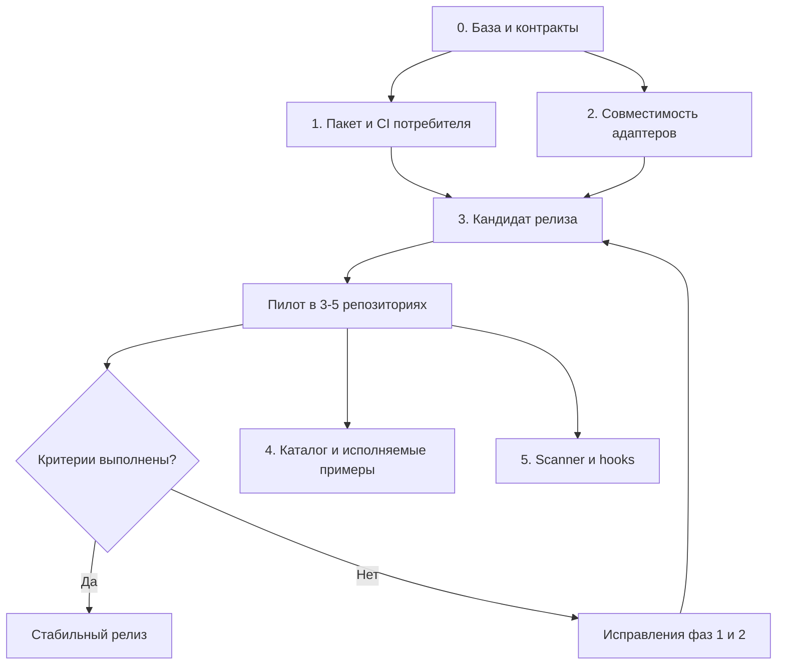

# План развития ContextOS

Дата пересмотра: 2026-09-26. Основание: [ADR-011](./decisions/0011-pivot-to-agent-governance-and-ci-gates.md) и ревью кода на коммите `530705f`.

**Статус: предложен к утверждению.** Принятый ADR задаёт направление продукта. Задачи ниже описывают будущую реализацию; создание этого документа не означает, что они выполнены или что релиз разрешён.

## 1. Результат, к которому идём

Команда хранит инженерные правила в Git, получает из них конфигурации выбранных AI-инструментов и обнаруживает рассинхронизацию в CI. Проверка должна работать в обычном пользовательском репозитории после установки npm-пакета.

Первый полезный результат:

1. Установить ContextOS в существующий проект.
2. Добавить или изменить собственное правило.
3. Сгенерировать конфигурации выбранных инструментов.
4. Убедиться, что инструменты обнаруживают эти инструкции.
5. Получить ошибку CI при изменении или удалении управляемого файла.
6. Восстановить согласованное состояние документированной командой.

Приоритет первого релиза: установка, корректный экспорт, проверка дрифта, понятная диагностика, сохранность пользовательских файлов.

Расширение каталога и анализ кода развиваются после первого пилота. Проверка конфигурации не является доказательством того, что модель всегда соблюдает инструкции или генерирует безопасный код.

### Границы

В текущий цикл входят стабильное ядро, шесть существующих адаптеров, npm-дистрибутив, GitHub Action и инструменты проверки каталога для авторов.

За пределами этого цикла: оркестрация агентов, новые исполнители моделей, Docker sandbox, изменение экспериментального `contextos-mcp`, облачный сервис, платёжная система и количественные обещания улучшения качества генерации. Границы согласованы с [PRD](./PRD.md) и [PRODUCT_BOUNDARIES](./PRODUCT_BOUNDARIES.md).

## 2. Отправная точка

| Возможность | Что уже существует | Оставшаяся работа |
| --- | --- | --- |
| Дрифт | [CLI](../.agents/ctx.js) поддерживает `export all --check`, `--diff`, `--json`; есть [drift-detector](../.agents/adapters/drift-detector.js) | Надёжность в пользовательском проекте, выбранные адаптеры, чистота проверки, обработка ошибок |
| Адаптеры | Шесть экспортёров; Cursor уже поддерживает `description`, `globs`, `alwaysApply` | Реальные пути загрузки, матрица совместимости, миграция и воспроизводимость |
| Инициализация | [Публичный CLI](../bin/index.js), определение стека и IDE, автоматический экспорт | Тестирование именно публичного пути, согласование двух реализаций init, понятный выбор инструментов |
| Валидация | [Валидатор](../.agents/validate.js) проверяет установленные навыки; `--catalog` включает каталог | Отдельный потребительский контракт и исполняемая проверка примеров для авторов |
| Упаковка | [Tarball smoke test](../tests/tarball-smoke.test.js), список `files`, release workflow | Полный пользовательский сценарий из упакованного артефакта |
| CI Action | [Composite Action](../.github/actions/contextos-gate/action.yml) | Убрать зависимость от внутренних скриптов и npm-тестов приложения |
| Секреты и hooks | [check-secrets.js](../scripts/check-secrets.js), [install-hooks.js](../scripts/install-hooks.js) | Чтение Git index, корень потребителя, сохранение существующих hooks, явные ошибки |

В предыдущем ревью выполнены 48 выбранных тестов: все успешны. `validate --catalog` проверил 7 базовых и 32 каталожных навыка без ошибок и предупреждений. `export all --check --json` сообщил об отсутствии дрифта у 41 артефакта. Это локальная проверка на Windows/Node 22.14.0, а не полная межплатформенная сертификация.

При начале ревью уже существовало изменение `.agents/lockfile.v2.json`. Фаза 0 завершается только после разбора этого изменения и повторной проверки согласованного коммита. Историческое число «384 теста» не используется как результат нового полного прогона.

### Выявленные риски реализации

- `--check` обрабатывается после применения `--profile`: проверочный режим необходимо доказать как режим без записи, включая профиль.
- `drift-detector.js` считает сиротами записи lockfile вне текущей проекции; нужно учитывать тип записи и выбранные адаптеры.
- В `adapters/shared.js` есть пути относительно расположения модуля. При вызове библиотечного API нельзя подменить навыки потребителя навыками пакета.
- Публичный init и `.agents/init/init-engine.js` используют разные пути выполнения. Тесты внутреннего engine не доказывают поведение установленной CLI.
- Проверка примеров через `includes()` подтверждает наличие текста, но не его исполнимость.
- Существующий сканер получает имена staged-файлов и читает рабочие копии. Его нельзя считать проверкой точного содержимого будущего коммита.

## 3. Контракты, которые фиксируем до реализации

### CLI и дистрибутив

- Имя npm-пакета: `contextos-agents`. Документированная установка: `npx contextos-agents init`. Исполняемый alias `contextos` не означает существования одноимённого npm-пакета. [Правила npm exec](https://docs.npmjs.com/cli/v11/commands/npm-exec/).
- Для воспроизводимого CI указывать конкретную версию пакета. При тестировании до публикации использовать локальный tarball.
- Переиспользовать `export <target> --check` и `--json`. Новый `validate --drift` в первый релиз не добавлять.
- `all` означает все шесть поддерживаемых адаптеров. Для проекта с частью инструментов задавать список в Action явно; проверка отдельного адаптера не требует остальных.
- Планируемый общий параметр проверочных команд: `--project <path>`. По умолчанию используется текущий каталог. В версии 2.0.0 наличие этого параметра не предполагается.
- Коды проверок: 0 - проверка выполнена и нарушений нет; 1 - обнаружено несоответствие; 2 - ошибка конфигурации, чтения или исполнения проверки. Любая ошибка блокирует CI.
- JSON имеет версию схемы, тип результата и пути относительно проекта. Предупреждения и ошибки не смешиваются с JSON в stdout.
- Read-only команды не меняют профиль, registry, lockfile или выходные файлы. Ошибку нельзя исправлять скрытым экспортом.

### CI и доверие к исполняемому коду

Action использует проверяющий код из фиксированной версии пакета. Правила, профили и конфиги входящего PR обрабатываются как данные. Action не исполняет находящийся в PR `.agents/ctx.js`, пользовательские lifecycle scripts или команды из навыков.

Проверка приложения остаётся отдельным шагом его workflow. Сам gate не требует `npm ci` и `npm test` приложения. Node нужен как среда исполнения ContextOS; наличие Node-приложения в репозитории не требуется.

Сканирование секретов до фазы 5 обозначается как `not_configured`, если оно не подключено отдельным инструментом. Явный запрос на неподдерживаемую проверку завершается ошибкой. При миграции старого `skip-secrets` нельзя молча ослаблять запрошенную проверку.

Путь публикации Action остаётся в текущем репозитории: `kok-o/contextos-agents/.github/actions/contextos-gate@<release-ref>`. Перед публикацией подставить существующий тег или SHA. Отдельный репозиторий `kok-o/contextos-gate` не нужен. [Синтаксис GitHub Actions](https://docs.github.com/en/actions/reference/workflows-and-actions/workflow-syntax).

### Совместимость и сохранность данных

- Основная матрица ядра: Node 22 и 24 на Ubuntu, Windows и macOS, как в текущих workflow.
- Минимальная заявленная версия `>=22.0.0` проверяется отдельно smoke-тестом. Если она не поддерживается фактически, уточнить `engines` и миграционную документацию.
- Генератор выдаёт UTF-8, LF, стабильный порядок и относительные пути. Отдельно описать допустимую нормализацию CRLF при сравнении checkout.
- Побайтовая воспроизводимость выходных артефактов и нормализация при обнаружении дрифта - разные проверяемые свойства.
- Неуправляемые файлы сохраняются. Управляемый файл с пользовательскими правками требует понятного конфликта или штатного механизма слияния.
- Изменение формата экспорта сопровождается миграцией. Удалять автоматически можно только доказанно принадлежащие ContextOS неизменённые устаревшие файлы.
- В стабильный пакет не попадают экспериментальный runtime, каталог целиком, браузеры и Python-зависимости проверок примеров.

## 4. Последовательность и рубежи

| Фаза | Результат | Зависимость | Статус |
| --- | --- | --- | --- |
| 0 | Подтверждённая база и точные контракты | Нет | Выполнена |
| 1 | Установленный пакет и gate работают в чужом репозитории | Фаза 0 | Выполнена |
| 2 | Подтверждена совместимость экспортов | Контракты фазы 0; финальная проверка после фазы 1 | Выполнена |
| 3 | Кандидат релиза, пилот, решение о стабильной версии | Фазы 1 и 2 | В работе |
| 4 | Исполняемые примеры и полезность каталога | Фаза 0; приоритеты уточняются по пилоту | Запланирована |
| 5 | Опциональный scanner и безопасные hooks | Фаза 1; решение по результатам пилота | Запланирована |



Нумерация изменена относительно прежней дорожной карты: ранняя упаковка перенесена из старой фазы 5 в фазы 1 и 3; качество каталога стало фазой 4; анализ кода и hooks собраны в фазе 5.

### Как исполнять задачи

Ответственный за реализацию - инженер проекта. Ревью выполняет другой инженер или отдельный проход проверки. Владелец проекта принимает решение о составе релиза и публикации.

Каждая строка таблиц - отдельная проверяемая задача с первоначальной оценкой до двух часов. Если расследование показывает больший объём, до реализации разбить её на меньшие задачи и обновить зависимости. Оценка не является обещанием срока.

Для кодовых изменений сначала воспроизвести проблему или зафиксировать ожидаемый сценарий тестом. Для изменения документации достаточно проверки содержания, команд и ссылок. Список новых тестовых файлов ниже является предложением; существующие наборы расширяются, когда это проще.

## 5. Фаза 0: подтвердить базу и закрепить решения

**Цель:** получить конкретный проверенный коммит и устранить неоднозначность контрактов.

**Файлы:** [package.json](../package.json), [README](../README.md), [MIGRATION](./MIGRATION.md), [CLI registry](../bin/commands.js), текущие workflow и этот документ. Новый отчёт: `docs/reviews/governance-baseline.md`.

| ID | Задача | Часы | Зависит от | Проверка / результат |
| --- | --- | --- | --- | --- |
| 0.1 | Записать SHA, Node/npm, статус дерева; разобраться с существующим изменением lockfile | 1 | Нет | Известно происхождение каждого изменения; пользовательская работа сохранена |
| 0.2 | Выполнить полный npm test, validate, validate --catalog и export all --check на согласованной базе | 2 | 0.1 | В отчёте есть команды, коды завершения, число тестов и ограничения среды |
| 0.3 | Сверить имя пакета, help, Node engines, путь Action и обещания документации | 1 | 0.1 | Таблица актуальных команд; планируемые флаги явно отмечены |
| 0.4 | Зафиксировать коды ошибок, чистоту check, виды управляемых файлов и выбор адаптеров | 2 | 0.3 | Контракт раздела 3 превращён в перечень тестовых сценариев |
| 0.5 | Сравнить публичный init и отдельный init-engine; выбрать путь первого релиза | 1 | 0.1 | Сохраняется публичный bin/index.js; перенос на другой engine допускается только при доказанной необходимости |
| 0.6 | Согласовать размер первого релиза, приоритеты адаптеров и отчёт о базе | 1 | 0.2-0.5 | Зафиксирован проверенный коммит; незакрытые дефекты имеют задачи и приоритеты |

Решение по init по умолчанию: доработать действующий публичный путь и тестировать его из tarball. Полная миграция на второй engine не является условием пилота. Если миграция нужна для сохранности данных, выделить её отдельным изменением и учесть несовпадение минимальных наборов навыков и lockfile.

**Приёмка фазы 0:**

- [ ] Новый полный прогон подтверждён результатами, а не перенесён из старого отчёта.
- [ ] Состояние исходных файлов и generated outputs согласовано.
- [ ] Статус существующего изменения lockfile установлен.
- [ ] Контракты раздела 3 и состав первого релиза не содержат неразрешённых блокирующих вопросов.
- [ ] Исходная версия сохранена в Git; повторная проверка возможна на том же коммите.

## 6. Фаза 1: пакет и CI в пользовательском проекте

**Цель:** пройти цикл «установка -> правило потребителя -> экспорт -> дрифт -> исправление» без доступа к checkout разработчика ContextOS.

**Файлы:** [bin/index.js](../bin/index.js), [bin/commands.js](../bin/commands.js), [pure-compiler](../.agents/adapters/pure-compiler.js), [shared](../.agents/adapters/shared.js), [drift-detector](../.agents/adapters/drift-detector.js), [validator](../.agents/validate.js), [lockfile-v2](../.agents/filesystem/lockfile-v2.js), [Action](../.github/actions/contextos-gate/action.yml), package.json и существующие тесты.

Новые файлы по необходимости: `bin/lib/gate.js`, `tests/consumer-gate.test.js`, `tests/fixtures/consumer-gate/`. Не создавать второй компилятор или второй drift engine.

| ID | Задача | Часы | Зависит от | Проверка / результат |
| --- | --- | --- | --- | --- |
| 1.1 | Создать tarball fixture потребителя с уникальным навыком, которого нет в пакете | 2 | Фаза 0 | Тест различает корень пакета и корень потребителя |
| 1.2 | Передать корень проекта через shared, загрузку профилей и рендер адаптеров | 2 | 1.1 | Уникальный навык присутствует в проекции; чужие навыки не подмешиваются |
| 1.3 | Обеспечить проверочные CLI-пути из установленного пакета с явным project root | 2 | 1.2 | Проверка не запускает подменённый .agents/ctx.js из fixture |
| 1.4 | Ограничить orphan-проверку типом записи и набором выбранных адаптеров | 2 | 0.4 | Проверка Cursor не считает файлы Claude или файлы дистрибутива сиротами |
| 1.5 | Обработать отсутствующий/повреждённый lockfile, неизвестный адаптер и ошибку загрузки | 1.5 | 1.4 | Нет ложного успеха при пустой проекции или ошибке; понятный код и причина |
| 1.6 | Устранить записи из check, включая --profile; разделить выбор и применение профиля | 2 | 1.3 | Снимок дерева и lockfile до/после одинаков при успехе и отказе |
| 1.7 | Согласовать JSON и коды 0/1/2; описать допустимую нормализацию checkout | 2 | 1.5, 1.6 | Парсируемый stdout; отрицательные случаи и CRLF проверены |
| 1.8 | Проверить missing, modified, stale source, orphan, конфликт путей и другой профиль | 2 | 1.4, 1.7 | Каждый сценарий получает ожидаемый статус; экспорт исправляет допустимый дрифт |
| 1.9 | Уточнить files allowlist и проверить необходимые модули внутри tarball | 1.5 | 1.3 | Проверочные пути работают после распаковки без исходного репозитория |
| 1.10 | Подключить Action к фиксированному runtime вне каталога PR | 2 | 1.7, 1.9 | Gate читает данные потребителя и не выполняет скрипты приложения |
| 1.11 | Добавить явные inputs версии, working-directory и списка адаптеров | 1.5 | 1.10 | Каталог с пробелами и список адаптеров корректны; аргументы не вставляются в shell-код |
| 1.12 | Добавить annotations и summary для pass, drift и tool error | 2 | 1.11 | При падении сохраняется отчёт; текст и пути экранированы; отсутствующие проверки видны |
| 1.13 | Пройти Action в отдельном репозитории с Node-приложением и без package.json | 2 | 1.12 | Оба проекта выявляют внесённый дрифт; нет зависимости от npm test приложения |
| 1.14 | Добавить матрицу Node 22/24 на трёх ОС и smoke минимальной engines-версии | 2 | 1.8, 1.13 | Отчёт отделяет реальные запуски на ОС от локальной имитации |
| 1.15 | Подключить новые наборы к npm test и CI, проверить отсутствие пропущенных файлов | 1 | 1.14 | Добавленный failing fixture действительно делает соответствующую job красной |
| 1.16 | Обновить help, пример workflow и миграцию старых inputs Action | 1 | 1.12-1.15 | Пример проверен в потребителе; неподключённый scanner не объявляется успешным |

### Обязательные сценарии потребителя

- Пустой Git-репозиторий, Node-приложение и Python/Go-репозиторий без package.json.
- Свой core skill и установленный plugin skill; активный профиль с исключённым навыком.
- Один выбранный адаптер и несколько адаптеров; остальные выходы отсутствуют намеренно.
- Изменённый источник, изменённый выход, удалённый выход, устаревший управляемый выход.
- Локальный пользовательский файл по целевому пути: конфликт объяснён, файл сохранён.
- В runtime пакета помещено другое тестовое правило; в результат попадает правило потребителя.
- Проверка падает при ошибке чтения/адаптера и не превращает её в «0 проблем».
- До/после check одинаковы содержимое и набор файлов, registry, профиль и lockfile.
- Одна и та же fixture даёт одинаковые генерируемые байты на трёх ОС; checkout CRLF проверяется отдельным сценарием.

**Приёмка фазы 1:**

- [x] Упакованный артефакт проходит все перечисленные пользовательские сценарии.
- [x] Action успешно запускается из другого репозитория.
- [x] Дрифт приводит к отказу CI с именем файла и корректной командой исправления.
- [x] Ошибка инструмента приводит к отказу с другим типом результата.
- [x] Проверки не записывают файлы и не выполняют код из входящего PR.
- [x] Права, inputs и поведение старых конфигураций описаны в миграции.
- [x] Git hooks пока не являются необходимым условием использования продукта.

## 7. Фаза 2: совместимость и миграция адаптеров

**Цель:** доказать, что поддерживаемые инструменты находят нужные правила, а совместный экспорт не создаёт конфликтов.

**Файлы:** [adapters](../.agents/adapters), [pure-adapters tests](../tests/pure-adapters.test.js), [export tests](../tests/export.test.js), [adapter-safety tests](../tests/adapter-safety.test.js), MIGRATION.md. Новые материалы: `docs/ADAPTER_COMPATIBILITY.md`, `tests/fixtures/adapter-contracts/`, `tests/adapter-compatibility.test.js`.

### Матрица контрактов

Источники ниже проверены при подготовке плана 2026-09-26. Перед реализацией уточнить версию конкретного продукта и повторно проверить документацию. Документированный формат и успешный запуск в редакторе фиксируются отдельно.

| Инструмент | Что проверять | Источник |
| --- | --- | --- |
| Cursor | MDC, description/globs/alwaysApply, постоянные и условные правила; уже реализованные поля сохранить | [Cursor Rules](https://cursor.com/docs/rules) |
| Claude Code | CLAUDE.md, импорты и область инструкций; сохранность существующего файла | [Claude memory](https://code.claude.com/docs/en/memory) |
| Gemini CLI | GEMINI.md, иерархия и импорты; фактический состав загруженного контекста | [Gemini context](https://geminicli.com/docs/cli/gemini-md/) |
| GitHub Copilot | Общий copilot-instructions.md и модульные .github/instructions/**/*.instructions.md; поддержка зависит от среды | [GitHub support matrix](https://docs.github.com/en/copilot/reference/custom-instructions-support) |
| Aider | Подключение conventions как read-only контекста, корректный конфиг и разрешение путей | [Aider conventions](https://aider.chat/docs/usage/conventions.html) |
| Zed | Документированные project instructions, AGENTS.md и совместимые файлы; порядок выбора при наличии других экспортов | [Zed instructions](https://zed.dev/docs/ai/instructions) |
| Antigravity | Отдельно исследовать IDE/CLI и загрузку workspace rules; не приравнивать к Gemini CLI | [Antigravity rules](https://antigravity.google/docs/rules?tab=ide) |

Для Zed нельзя считать генерацию `.zed/rules.md` достаточным доказательством загрузки правил. Для Antigravity требуется отдельное решение по путям: пространство `.agents/rules` уже используется самим ContextOS. Не менять его назначение и не объявлять совместимость без проверки конфликтов.

**Порядок работы:** сначала Cursor, Claude Code и Gemini CLI; затем Copilot, Aider и Zed. Это порядок устранения рисков, а не автоматическое исключение существующих адаптеров из релиза.

| ID | Задача | Часы | Зависит от | Проверка / результат |
| --- | --- | --- | --- | --- |
| 2.1 | Записать версии, режимы продукта, entrypoints и источники требований | 1 | 0.3 | У каждого адаптера есть конкретный контракт и статус проверки |
| 2.2 | Создать небольшой общий набор правил с разными scope и узнаваемым тестовым текстом | 2 | 2.1 | Fixture позволяет отличить загрузку нужного правила от простого наличия файла |
| 2.3 | Проверить Cursor и исправить только найденные несовместимости | 2 | 2.2, 1.2 | Синтаксис MDC и сопоставление globs подтверждены тестами |
| 2.4 | Проверить Claude Code entrypoint и импорты | 2 | 2.2, 1.2 | Собственные инструкции сохраняются; ссылки разрешаются из потребителя |
| 2.5 | Проверить Gemini CLI entrypoint, импорты и профиль | 2 | 2.2, 1.2 | Экспорт соответствует выбранному набору навыков |
| 2.6 | Добавить/уточнить модульные Copilot instructions и область applyTo | 2 | 2.2, 1.2 | Общие и файловые инструкции разделены; среда поддержки указана |
| 2.7 | Исправить точку загрузки Zed и конфликт с другими instruction-файлами | 2 | 2.2, 1.4 | При совместном экспорте загрузчик выбирает ожидаемые инструкции |
| 2.8 | Проверить Aider read-конфиг и пользовательские настройки | 2 | 2.2, 1.2 | Пути корректны; повторный экспорт не уничтожает чужие параметры |
| 2.9 | Исследовать Antigravity и принять решение о самостоятельном контракте | 1 | 2.1 | Поддержка подтверждена отдельно либо явно отложена; нет записи поверх внутренних rules |
| 2.10 | Проверить совместное присутствие всех шести экспортов и коллизии | 2 | 2.3-2.8 | Нет перезаписи чужого entrypoint и незаметного изменения приоритета |
| 2.11 | Добавить миграционные fixtures старых outputs и пользовательских правок | 2 | 2.10 | Обновление сохраняет пользовательские файлы; конфликты имеют инструкцию решения |
| 2.12a | Провести smoke в Cursor и Claude Code | 2 | 2.3, 2.4, 1.9 | Записаны версии, загруженные правила, результаты scoped-сценариев |
| 2.12b | Провести smoke в Gemini CLI и Copilot | 2 | 2.5, 2.6, 1.9 | Проверена реальная поддерживаемая среда, а не только snapshot |
| 2.12c | Провести smoke в Aider и Zed | 2 | 2.7, 2.8, 1.9 | Подтверждена загрузка в изолированном и совместном сценарии |
| 2.13 | Сравнить хэши повторного экспорта на трёх ОС | 2 | 2.10, 1.14 | Равны реальные bytes fixtures; отдельный тест проверяет нормализацию checkout |
| 2.14 | Обновить совместимость, инструкции миграции и статус ограничений | 1 | 2.9, 2.11-2.13 | Публичные обещания соответствуют доказательствам |

### Как проводить smoke редактора

На чистом профиле открыть fixture, проверить обнаружение инструкций средствами самого инструмента, затем выполнить задачу с явно различимым правилом. Для условного правила проверить файл, попадающий под glob, и файл вне области.

Зафиксировать версию инструмента, ОС, ревизию навыков, выбранный адаптер и наблюдаемый результат. Успешный ответ модели сам по себе не доказывает корректность механизма загрузки.

Если инструмент недоступен, статус остаётся `not_verified`. Его не заменяет успешная генерация Markdown. При нехватке доступных сред допустим кандидат релиза с явными ограничениями; стабильные обещания расширяются только после подтверждения.

**Приёмка фазы 2:**

- [x] На все шесть адаптеров есть контрактные тесты и запись в матрице.
- [x] Реальные smoke подтверждают заявляемую в релизе поддержку.
- [x] Пользовательские CLAUDE.md, GEMINI.md, AGENTS.md, конфиги Aider и другие entrypoints сохраняются.
- [x] Проверен совместный экспорт, включая порядок загрузки Zed.
- [x] Миграционные и повторные экспорты детерминированы.
- [x] Публичное обещание «все актуальные версии» заменено конкретной матрицей.

## 8. Фаза 3: ранний релиз и пилот

**Цель:** проверить полезность управления правилами в реальных репозиториях до расширения продукта.

Первый кандидат ориентирован на `2.1.0-rc.N`, стабильная версия - на `2.1.0`. Это плановые номера. Если необходимы несовместимые изменения публичного контракта, до публикации пересмотреть версию и миграцию.

**Файлы:** [bin/index.js](../bin/index.js), [init tests](../tests/init-engine.test.js), [install tests](../tests/install.test.js), [tarball tests](../tests/tarball-smoke.test.js), [package size check](../scripts/verify-package-size.js), [publish workflow](../.github/workflows/publish.yml), README, GUIDE, CHANGELOG, MIGRATION.

Новые материалы: `docs/product/pilot-protocol.md`, `docs/product/pilot-results.md`, `tests/consumer-init.test.js`. Тесты внутреннего engine сохраняются, но не заменяют проверку публичной CLI.

| ID | Задача | Часы | Зависит от | Проверка / результат |
| --- | --- | --- | --- | --- |
| 3.1 | Проверить публичный init: пустой проект, minimal, auto, выбранный агент/профиль | 2 | Фазы 1, 2; 0.5 | Тест запускает bin из tarball и затем проверяет созданные outputs |
| 3.2 | Проверить повторный init, dry-run, существующий .agents и конфликт entrypoint | 2 | 3.1 | Нулевая запись в dry-run; пользовательские изменения сохранены |
| 3.3 | Проверить отказ установки и повторный запуск после сбоя | 2 | 3.2 | Нет частично принятого состояния; понятное восстановление |
| 3.4 | Подготовить короткий onboarding и воспроизводимый пример workflow | 1 | 3.1 | Новый пользователь выполняет цикл без знания внутренних каталогов |
| 3.5 | Собрать release candidate из конкретного SHA и проверить состав/размер tarball | 2 | 3.3, 3.4 | Зафиксированы версия и SHA-256 артефакта; соблюдён текущий лимит размера 2 MiB |
| 3.6 | Подготовить release notes и провести публикацию кандидата через release workflow | 1 | 3.5 | Опубликован именно проверенный кандидат; npm latest не переключён |
| 3.7a | Пройти протокол пилота в первом Node/TypeScript-репозитории | 2 | 3.6 | Сохранены время подключения, сценарии дрифта и затруднения |
| 3.7b | Пройти протокол во втором репозитории без Node-приложения | 2 | 3.6 | Нет зависимости gate от package.json или npm test приложения |
| 3.7c | Пройти протокол в третьем репозитории с существующими AI-конфигами | 2 | 3.6 | Проверены конфликты, миграция и сохранность пользовательских правил |
| 3.8 | Разобрать результаты, приоритизировать проблемы и принять решение по кандидату | 2 | 3.7a-3.7c | Нет незакрытых блокеров; изменения требуют нового кандидата и адресного повторения пилота |
| 3.9 | Подготовить стабильный артефакт, повторить release gates и выпустить версию | 2 | 3.8 и критерии стабильного релиза | Проверена окончательная версия; теги и package metadata согласованы |
| 3.10 | Проверить публичную установку и опубликовать инструкции обновления/восстановления | 1 | 3.9 | Установка фиксированной версии, экспорт и gate воспроизводимы |

Публикация выполняется отдельным действием после готовности артефакта и решения владельца проекта. Этот план сам по себе не является командой на публикацию.

### Протокол пилота

Набрать 3-5 репозиториев. Для решения о стабильном релизе минимально нужны три завершённых сценария выше, не менее двух участников и хотя бы один участник, не являющийся автором реализации.

Для каждого репозитория:

1. Зафиксировать версию кандидата, ОС/Node, тип проекта, инструменты и существующие конфиги.
2. Установить ContextOS по onboarding; отдельно измерить скачивание и время настройки.
3. Добавить собственное правило, выполнить экспорт и первую успешную проверку.
4. Изменить управляемый файл, убедиться в отказе CI и исправить штатным способом.
5. Изменить источник правила, повторить цикл.
6. Проверить выбранные инструменты и одну повседневную задачу разработчика.
7. Записать потребовавшиеся ручные действия, непонятные сообщения, ложные срабатывания и случаи потери/конфликта данных.
8. Через 5-10 рабочих дней записать, оставлен ли gate включённым и почему.

Время ожидания участников и наблюдения не входит в оценки инженерных задач 3.7a-3.7c.

### Условия стабильного релиза

- [x] Полный набор core-тестов, валидация проекта/каталога и Markdown-проверки проходят на release commit.
- [x] Упакованный артефакт проходит consumer tests; финальная версия пересобрана и проверена после изменения version.
- [x] Матрица Node/ОС успешна; реальные проверки редакторов соответствуют заявленной поддержке.
- [x] Минимум три пилотных репозитория проходят полный цикл.
- [x] Нет потери данных, пропущенного дрифта в заявленных сценариях, ложных блокировок на контрольных fixtures и необъяснённого молчаливого успеха.
- [x] Публикуемые release notes перечисляют ограничения и миграцию.
- [x] Ошибка установки, потеря данных или пропущенное обязательное несоответствие возвращают кандидат в фазу 1/2.
- [x] Обновление не опирается на экспериментальный MCP/runtime.

### Восстановление после неудачного релиза

До публикации проверить сценарий на fixture версии 2.0.0. Предыдущая установка и исходные правила доступны из Git. Пользователь закрепляет предыдущую версию инструмента, восстанавливает принадлежащие ему конфиги из сохранённого состояния и повторяет проверку.

Если формат lockfile или выходов не читается предыдущей версией, описать точный обратный переход. Не предлагать массовое удаление .agents или принудительную перезапись пользовательских файлов как универсальный способ восстановления.

### Что не задерживает первый пилот

Полноценный интерактивный wizard, GitHub Template Repository, новые адаптеры и сканер кода остаются отдельными улучшениями. Для пилота достаточно проверенных параметров CLI и примера workflow.

После пилота wizard добавляется только поверх того же плана init: отдельные задачи на выбор стека/инструментов, проверку non-TTY режима и совпадение интерактивного результата с явными аргументами. В CI вопросы не задаются.

## 9. Фаза 4: качество каталога и исполняемые примеры

**Цель:** каждое утверждение о проверенности навыка должно соответствовать выполненной проверке.

**Первый охват:** `fastapi`, `web-accessibility`, `adapters` из каталога и примеры базового `security`. Затем - TypeScript, React, Node и Database по приоритетам пилота.

**Файлы:** [catalog/skills](../catalog/skills), [core security](../.agents/core/skills/security/SKILL.md), [catalog-export integration test](../tests/catalog-export-integration.test.js), [validator](../.agents/validate.js), [benchmark protocol](./BENCHMARK_PROTOCOL.md). Новые файлы: `scripts/verify-skill-examples.js`, `tests/skill-examples.test.js`, `tests/fixtures/skill-examples/`, `docs/product/catalog-quality.md`.

Это инструменты авторского CI. Установка ContextOS в пользовательский проект не должна требовать Python, браузер или весь каталог.

### Классификация примеров

Каждому блоку кода в заявленном охвате назначаются ID, исходный файл, язык, тип, зависимости и способ проверки.

| Тип | Требование |
| --- | --- |
| runnable | Извлечённый из актуального SKILL.md код запускается либо компилируется в объявленной fixture |
| illustrative | В тексте явно указано, что это фрагмент/псевдокод; есть причина отсутствия исполнения |
| expected-failure | Негативный пример должен вызвать конкретную ожидаемую ошибку |
| unverified | Временный статус бэклога; не засчитывается как доказанная корректность |

В тест исполняемого примера попадает код из навыка, а не вручную переписанная копия. Если нужен wrapper, зависимости и граница wrapper явно описываются. Удаление или изменение блока инвалидирует его соответствие fixture. Пропуск обязательной среды является ошибкой проверки.

| ID | Задача | Часы | Зависит от | Проверка / результат |
| --- | --- | --- | --- | --- |
| 4.1 | Инвентаризировать блоки первого охвата и зарегистрировать остальной каталог как backlog | 1.5 | Фаза 0 | У каждого блока первого охвата есть ID и классификация |
| 4.2 | Определить минимальный формат метаданных примера и fixture | 1 | 4.1 | Есть source, язык, тип, команда, зависимости и ожидаемый результат |
| 4.3 | Реализовать извлечение блоков и проверку полноты инвентаря | 2 | 4.2 | Изменённый/удалённый блок обнаруживается; диагностика указывает строку |
| 4.4 | Добавить JS/TS fixture с синтаксической и типовой проверкой | 2 | 4.3 | Неразрешённый импорт и синтаксическая ошибка приводят к отказу |
| 4.5 | Проверить FastAPI-пример в изолированной среде объявленных зависимостей | 2 | 4.3 | Позитивные и негативные случаи payload/JWT выполняются; реальный секрет не нужен |
| 4.6 | Проверить dialog-пример в браузерной fixture | 2 | 4.4 | Открытие/закрытие, Escape, переходы фокуса и возврат фокуса работают |
| 4.7 | Проверить сетевой пример security через контролируемый transport | 2 | 4.4 | Неподходящий host, credentials, redirect и timeout обработаны; нет реальных внешних запросов |
| 4.8 | Проверить команды из adapters на подготовленном consumer fixture | 1 | Фаза 1, 4.3 | Команды существуют и дают ожидаемый результат |
| 4.9 | Заменить обещания технической корректности в includes-тестах | 1.5 | 4.5-4.8 | Export smoke сохранён; испорченный код теперь действительно делает тест красным |
| 4.10 | Уточнить ограничения TypeScript/React и добавить корректные/некорректные примеры | 2 | 4.4 | Допустимый catch с inferred unknown не запрещён; реальные опасные обращения отклоняются |
| 4.11 | Уточнить правила Node/Database с учётом стека и нагрузки | 2 | 4.1 | Нет безусловного требования лишних индексов или выбранной библиотеки без основания |
| 4.12 | Подключить отдельный author CI и отчёт покрытия примеров | 2 | 4.9-4.11 | Missing runtime, failed verifier и unverified не становятся зелёной проверкой |
| 4.13 | Пройти 3-5 фиксированных задач регрессии навыков | 2 | 4.12 | Записаны задача, модель/версия, ревизия навыка, ожидание и результат |
| 4.14 | Опубликовать охват и выбрать следующую небольшую группу навыков | 1 | 4.13, результаты пилота | Число проверенных примеров отделено от числа навыков с валидными metadata |

### Правила качества инструкций

- TypeScript: ошибки обрабатываются как unknown с безопасным сужением. `catch (e)` допустим, если настройки компилятора уже дают unknown. [TypeScript useUnknownInCatchVariables](https://www.typescriptlang.org/tsconfig/useUnknownInCatchVariables.html).
- React: запрещаются прямые мутации React state и дублирование вычисляемых данных без необходимости. Сам факт вызова setter не является нарушением.
- Database: значения передаются параметризованно; индексы оцениваются по СУБД, ограничениям и запросам. Автоматический индекс на каждый внешний ключ не объявляется универсальным правилом.
- Node/API: внешние операции имеют таймаут/отмену, а завершение долгоживущего сервиса корректно обрабатывает ресурсы.
- Security: валидировать входные данные на границах; использовать подходящие средства текущего стека. Пример allowlist не доказывает наличие сетевого egress-контроля в приложении.
- Для доступности различать автоматические проверки поведения и ручную проверку с вспомогательными технологиями; не обещать полное покрытие screen reader одним browser test.
- Каждое правило содержит область применения, обоснование и способ проверки; объём текста не используется как метрика качества.

**Приёмка фазы 4:**

- [x] Все блоки первого охвата классифицированы; у runnable нет статуса unverified.
- [x] Проверяется фактический исходный код навыков.
- [x] Есть отрицательные тесты, доказывающие, что поломка примера обнаруживается.
- [x] Отчёт различает синтаксис, типы, исполнение и ручные проверки.
- [x] Правки навыков переэкспортированы и проходят существующий drift gate.
- [x] Пилот 3-5 задач используется как регрессионная проверка; общие обещания эффективности из него не выводятся.
- [x] Остальные навыки добавляются явными группами; «весь каталог проверен» допустимо только при полном учёте инвентаря.

## 10. Фаза 5: опциональный scanner и безопасные hooks

**Цель:** добавить проверку точного содержимого коммита с понятными ограничениями и контролируемыми ложными срабатываниями.

Фаза начинается после решения по пилоту. Если основной gate не востребован или его эксплуатация требует исправлений, сначала устранить эти проблемы.

**Файлы:** [check-secrets](../scripts/check-secrets.js), [hook installer](../scripts/install-hooks.js), bin/index.js, bin/commands.js, package.json, Action. Новые модули по необходимости: `bin/lib/scan.js`, `bin/lib/git-snapshot.js`, `bin/commands/hook.js`; тесты `tests/scan.test.js`, `tests/hooks.test.js` и fixtures.

Имеющиеся проверки в экспериментальном reviewer pipeline используются как материал для отрицательных примеров. Стабильный пакет не импортирует `contextos-mcp` и не меняет его архитектуру ради scanner.

### Предлагаемый CLI

Команды ниже пока являются проектируемым интерфейсом:

```sh
contextos scan --staged
contextos scan --staged --secrets --json
contextos scan --staged --placeholders --enforce
contextos scan --staged --scope task-scope.json --enforce
contextos hook install
contextos hook uninstall
```

При отсутствии селектора проверяются secrets и placeholders. По умолчанию найденные нарушения выводятся как предупреждения; `--enforce` включает код 1 при находках включённых правил. Ошибка самого сканирования всегда возвращает 2, включая режим предупреждений.

Первый релиз scanner поддерживает staged snapshot. Проверка диапазона коммитов добавляется отдельной задачей после стабилизации этого режима.

### Семантика проверки

- Секреты проверяются в staged-содержимом подходящих изменённых файлов целиком.
- Заглушки ищутся в добавленном коде, с учётом языка и типа файла. Удалённые строки и контекст diff не являются новыми нарушениями.
- Данные берутся из Git index текущего проекта. Рабочая копия и каталог установки пакета не подменяют snapshot.
- Имена файлов читаются через NUL-delimited Git output. Поддерживаются пробелы, Unicode, rename, delete и пути с дефисом.
- Вывод содержит rule ID, файл, строку и объяснение без значения секрета. Исключения и подавленные находки отражаются в отчёте.
- Ошибка Git, нечитабельный обязательный blob, неверная конфигурация или превышенный лимит обязательной проверки дают неполный результат с кодом 2.
- Документированные исключения для бинарных/больших файлов видны как исключения. Они не входят в обещанный охват проверки.
- Произвольный JWT или строка, похожая на ключ, не объявляется гарантированно действующим секретом. Список распознаваемых шаблонов и ограничения фиксируются.
- Отсутствующий write scope означает `not_checked`. Если scope запрошен явно, отсутствующая/повреждённая декларация является ошибкой.
- Декларация scope содержит разрешённые пути/globs относительно репозитория и основание задачи. Абсолютные пути и выход за корень отклоняются.
- Правила исключений задаются по конкретному rule ID и пути с обязательным объяснением. Весь каталог tests не исключается автоматически.

### План задач

| ID | Задача | Часы | Зависит от | Проверка / результат |
| --- | --- | --- | --- | --- |
| 5.1 | Зафиксировать интерфейс, rule IDs, коды результата и охват сканирования | 1 | Решение по фазе 3 | Есть спецификация успешного, нарушенного и неполного результата |
| 5.2 | Реализовать чтение корня проекта и staged blobs | 2 | 5.1 | Сканируются bytes индекса; путь пакета не влияет на результат |
| 5.3 | Добавить fixtures частичного staging, rename/delete и необычных имён | 2 | 5.2 | Секрет в index после unstaged-удаления обнаруживается; обратный случай не приписывается коммиту |
| 5.4 | Перенести поддерживаемые детекторы секретов в упаковываемый модуль | 2 | 5.1, 5.2 | Нет зависимости от scripts каталога автора; диагностика не раскрывает ключи |
| 5.5 | Обработать ошибки Git, unreadable blobs и превышение лимитов | 1.5 | 5.2, 5.4 | Ошибка не превращается в «нет файлов» или «проверено успешно» |
| 5.6 | Добавить узкие правила заглушек для добавленного кода | 2 | 5.2 | Удаление TODO, документация шаблона и допустимый pass не блокируются |
| 5.7 | Добавить явные исключения и ограниченные suppressions | 1.5 | 5.4, 5.6 | Причина обязательна; отчёт показывает исключения и количество подавлений |
| 5.8 | Добавить проверку объявленного write scope | 2 | 5.1, 5.2 | Изменения вне разрешённых путей обнаруживаются; некорректный scope отклоняется |
| 5.9 | Согласовать текст/JSON и редактирование чувствительных данных | 1 | 5.5-5.8 | Автотест проверяет отсутствие исходного значения секрета во всём выводе |
| 5.10 | Подключить scan к публичному CLI и scripts/check-secrets как тонкой обёртке | 2 | 5.9 | Один стабильный детектор; legacy-команда имеет явную миграцию поведения |
| 5.11 | Подготовить проверку дрифта по staged-источникам и staged-outputs для hook | 2 | Фаза 1, 5.2 | Исправленный только в рабочем дереве output не скрывает дрифт будущего коммита |
| 5.12 | Реализовать явную установку hook с разрешением git path и core.hooksPath | 2 | 5.10, 5.11 | Работает в обычном repo и worktree; не меняет глобальную конфигурацию Git |
| 5.13 | Обработать существующий hook/менеджер hooks и повторную установку | 2 | 5.12 | Чужой hook сохранён либо выдан конфликт; установка идемпотентна |
| 5.14 | Реализовать uninstall только принадлежащего ContextOS блока | 1.5 | 5.13 | Пользовательские команды и правки сохранены |
| 5.15 | Проверить scan/install/uninstall из tarball на трёх ОС | 2 | 5.10-5.14 | Нет checkout-only импортов; не требуется экспериментальный runtime |
| 5.16 | Добавить opt-in scan в Action и пример установки enforcing hook | 1.5 | 5.15 | Предупреждения и enforcement различимы; ошибки инструмента всегда блокируют |
| 5.17 | Пройти контрольный корпус и пилот, принять решение о включаемых правилах | 1 | 5.16 | Записаны реальные и ложные находки по rule ID; неоднозначные правила остаются advisory |

### Критические приёмочные случаи

| Сценарий | Ожидаемый результат |
| --- | --- |
| Секрет staged, затем удалён из рабочей копии без git add | Находка сохраняется |
| В index чистая версия, секрет появился только unstaged | Не считается секретом будущего коммита |
| Заглушка удалена, её строка присутствует только в минусовой части diff | Нового нарушения нет |
| В документации описан запрещённый шаблон | Не считается исполняемой заглушкой |
| Допустимый pass/пустой обработчик в явно обоснованном контексте | Нет безусловной блокировки по одному слову |
| Git завершился с ошибкой | Код 2, scan incomplete |
| Добавлен/удалён файл вне явного scope | Scope violation с понятным путём |
| Источник/выход в index рассинхронизированы, рабочая копия уже исправлена | Enforcing hook отклоняет коммит |
| Index согласован, рабочая копия содержит дополнительные unstaged-правки | Они не меняют результат проверки будущего коммита |
| В проекте уже есть hook | Чужой код сохранён или установка прекращена с конфликтом |
| Uninstall после пользовательского изменения hook | Удаляется только неизменённая собственная часть либо выдаётся конфликт |

**Приёмка фазы 5:**

- [ ] Позитивные и негативные fixtures проходят на трёх ОС.
- [ ] Проверка соответствует index; неполное сканирование не даёт успешный результат.
- [ ] На контрольном корпусе нет ложных блокировок разрешённых примеров.
- [ ] Правила с неясной точностью не включены в обязательный режим.
- [ ] Коммит блокируется только установленным hook, который вызывает enforcement и обрабатывает ненулевой код.
- [ ] Hooks проверены с core.hooksPath, worktree, повторной установкой и uninstall.
- [ ] Стабильный пакет по-прежнему независим от экспериментального runtime.

## 11. Метрики и правила продолжения

Значения ниже являются целями и условиями приёмки. Они не описывают уже достигнутые показатели.

| Метрика | Как измерять | Условие |
| --- | --- | --- |
| Полнота обнаружения заявленного дрифта | Зафиксированный набор positive/negative consumer fixtures | Все случаи проходят; охват перечислен явно |
| Чистота check | Снимок файлов, registry, профиля и lockfile до/после | Никаких изменений, включая ошибки и --profile |
| Воспроизводимость | Сравнение байтов одинаковой fixture на Node/ОС матрице | Результаты совпадают |
| Первое локальное успешное подключение | От запуска команды до зелёной проверки; отдельно cold/warm | Цель warm-медианы <=2 минут в пилоте; cold публикуется отдельно |
| Время первого CI | От запуска workflow до результата | Записывается отдельно от настройки и скачивания |
| Самостоятельность внедрения | Сколько шагов потребовали помощи автора | Хотя бы один неавтор проходит onboarding без изменения кода инструмента |
| Продолжение использования | Опрос владельцев через 5-10 рабочих дней | Причины сохранения/отключения gate записаны; при повторных отказах приоритет у исправления основного сценария |
| Качество примеров | Количество runnable/illustrative/expected-failure/unverified и тип проверок | Полное покрытие заявленного первого охвата |
| Ложные блокировки scanner | Контрольный корпус и ручная классификация пилотных находок | 0 на разрешённых контрольных примерах; спорные правила остаются необязательными |
| Целостность установки | Конфликты, прерывания, update и восстановление | 0 случаев потери пользовательских данных |

Если в пилоте большинство участников не сохраняет gate включённым, сначала выяснить причины и пересмотреть основной сценарий. Расширение каталога и scanner не служит автоматическим ответом на отсутствие ценности.

## 12. Оценки, резерв и первый рабочий цикл

Оценки в таблицах учитывают реализацию, локальную адресную проверку и краткое ревью каждого изменения. Они не включают ожидание CI, доступов к редакторам, публикации и участников пилота.

При планировании использовать одного инженера и около четырёх часов сосредоточенной работы в день. Добавить 30% резерва на интеграцию и повторную проверку найденных дефектов. Пересчитать оценки после фазы 0 и после первого consumer test.

Ниже после проверки документа фиксируются суммы задач по фазам. Срок до стабильной версии дополнительно зависит от наблюдения пилота в течение 5-10 рабочих дней; в это время можно выполнять независимые задачи каталога.

### Первый рабочий цикл: примерно 20 часов

1. Выполнить 0.1-0.6: подтвердить базу, договориться о контрактах и публичном пути init.
2. Выполнить 1.1: получить падающий consumer test с уникальным навыком.
3. Выполнить 1.2 и 1.3: читать правила потребителя и запускать проверенный код пакета.
4. Выполнить 1.4 и 1.5: устранить ложные orphan-находки и ложный успех при ошибках.
5. Выполнить 1.6: доказать отсутствие записей в check.

Результат первого цикла: установленный пакет корректно проверяет данные отдельного проекта; ошибки и дрифт различаются; check не изменяет файлы. Полноценный Action и обещание готового релиза появляются после остальных задач фазы 1.

## 13. Риски и действия при их наступлении

| Риск | Ранний сигнал | Действие |
| --- | --- | --- |
| Повторная реализация уже работающего механизма | Новый drift/init engine без consumer test | Сначала расширить текущий публичный путь и доказать необходимость замены |
| Проверяется каталог пакета вместо проекта | Уникальное правило потребителя отсутствует в экспорте | Заблокировать интеграцию Action до исправления project-root |
| Ложные orphan-находки | Чистая установка или частичный экспорт всегда красные | Проверять ownership и выбранные адаптеры |
| Обновление ломает пользовательские инструкции | Конфликт entrypoint или изменённый managed output | Сохранить файл, показать конфликт, покрыть миграционной fixture |
| Документация инструмента изменилась | Формат есть, но редактор правила не обнаруживает | Обновить матрицу и адаптер; не расширять обещания без smoke |
| Antigravity использует путь внутренних rules | Обнаружена коллизия с .agents/rules | Выделить отдельный контракт/бэклог; не менять назначение каталога автоматически |
| Нехватка подтверждений совместимости | Нет доступа к нужной среде | Оставить not_verified и ограничить обещания кандидата |
| Каталог требует много зависимостей | Браузеры/Python попадают в consumer package | Оставить проверки в author CI и dev fixtures |
| Scanner выдаёт шум | Допустимые изменения блокируются | Сузить правило или оставить warning; добавить негативный пример |
| Объём выходит за первоначальную оценку | Задача не помещается в два часа после расследования | Разбить задачу, обновить часы и зависимости до продолжения |
| Пользователи не видят пользы gate | Он отключается после пилота | Приостановить расширения и исправить установку, диагностику или продуктовый сценарий |

## 14. Общий критерий завершения

План считается исполненным, когда у каждой принятой задачи есть результат и доказательство проверки, релизные обещания соответствуют матрице совместимости, пользовательские сценарии подтверждены из опубликованного пакета и по пилоту принято записанное решение.

Фазы 4 и 5 могут выпускаться отдельными последующими версиями. Их отсутствие не блокирует первый стабильный релиз управления правилами после успешных фаз 0-3.
